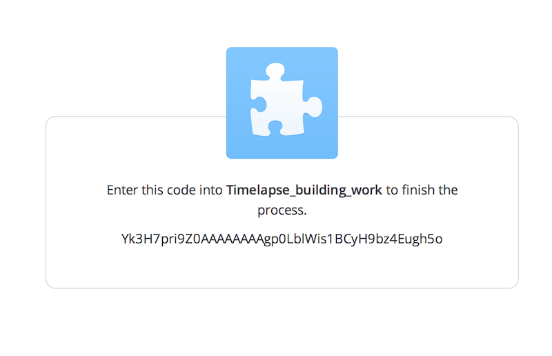

Plant Cam
===================


### Why? What?

At the moment the `single.py` code just takes one photo every time it is run. I am planning on running it using cron.

**PLEASE NOTE - Don't panic, I have changed all the keys and things, so I'm leaking personal info **

You can check out my timelapse photos [here](https://www.dropbox.com/sh/hwzk4ibneot0nlj/AABeGXH2EsnSxfKrGJeh7ObIa?dl=0).


### Setting Up Dropbox

Sign up to Dropbox Apps
https://www.dropbox.com/developers/apps

##### Create App


##### Dropbox API app


1. What type of data does your app need to store on Dropbox?
Files and datastores
1. Can your app be limited to its own folder?
Yes
1. Name your app
1. Create App.


You will need this information for later:
* App key
* App secret

### Setting Up Raspberry Pi

Fresh Raspian install

enable camera (if you miss it the first time, just run `raspi-config`) - This ask you to then reboot the pi.

Make sure you are connected to the Internets. (I would SSH into your pi now)

```bash
sudo apt-get update
sudo apt-get upgrade
sudo apt-get install python-pip
sudo pip install dropbox
```

Depending on your internet connection this may take a while.

Then we want to download this github repo.:

```bash
git clone https://github.com/RZRZR/plant_cam.git
```

Enter the directory

```bash
cd plant_cam
```
### Setting up API
We need to put in our app key and secret, so open api.py
```bash
nano api.py
```
Replace key and secret with your Dropbox details. It should look like this:

```python
app_key = '059dr5c4cpncyhe'
app_secret = 'yjz7d06x3s462t6'
```


Run the `single.py` script

```bash
python single.py
```

### Authorising Dropbox
First time you run `single.py` it will ask you to authorise the app use with Dropbox. Follow the the instructions in terminal.
```bash
pi@raspberrypi ~/plant_cam $ python single.py
1. Go to: https://www.dropbox.com/1/oauth2/authorize?response_type=code&client_id=099dr5c4cpncyhe
2. Click "Allow" (you might have to log in first)
3. Copy the authorization code.
Enter the authorization code here:
```



Once you've entered your authorisation code it will save your access_token in the `access_token.py` and you won't need to authorise it again. It'll look something like this:
```python
key = 'Yk3H7pri9Z0AAAAAAAAgrb4SFdLYqEdpMOR-Vv-wSJoVSQhiO7AYm2SXsWN1Ycbk'
```
If you *want* to re-authorise, if you have a new app key and secret for example. Open `access_token.py` in nano and remove the key string, leaving it looking like this:
```python
key = ''
```

### Onward!

After the first time you will see:

```bash
pi@raspberrypi ~/plant_cam $ python single.py
You are authorised!
Captured img2014-06-20_10-36-25.jpg
sending img2014-06-20_10-36-25.jpg to dropbox
uploaded: img2014-06-20_10-36-25.jpg
```


And it's uploaded to Dropbox! oh... but you see the time and date is all wrong? That's annoying..

### Set Date and Time

```bash
sudo apt-get install ntpdate
```
Then we want to make sure we are set to the right timezone.

```bash
sudo raspi-config
```

Select 4 - Internationalisation Options
Select I2 - Change Timezone
Select the correct place for you and you will see something like this:

```bash
Current default time zone: 'Europe/London'
Local time is now:      Fri Jul 18 18:13:36 BST 2014.
Universal Time is now:  Fri Jul 18 17:13:36 UTC 2014.
```

So, let's try taking another photo.


That's better!

### Scheduling the script

```bash
sudo crontab -e
```
We are using *sudo* crontab because we may want to use the GPIOs in future.
add this line to run the script every 15 minutes:
```bash
*/15 * * * * python /home/pi/plant_cam/single.py >> /home/pi/picamera-dropbox.log 2>&1


* */1 * * * find /home/pi/plant_cam -mtime +3 -name 'plant*' -exec rm {} \;
```

Create your log file
```bash
cd
touch picamera-dropbox.log
```

to watch the log updating:

```bash
watch cat picamera-dropbox.log
```

It'll look something like this:
```bash

You are authorised!
Captured img2014-07-18_19-04-05.jpg
sending img2014-07-18_19-04-05.jpg to dropbox
uploaded: img2014-07-18_19-04-05.jpg
